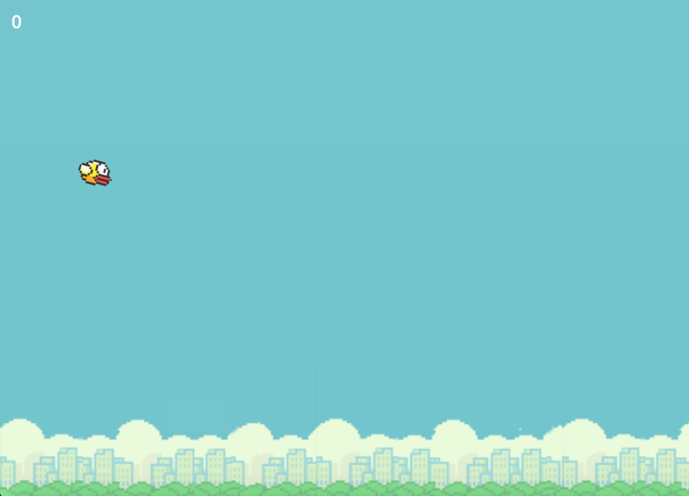

# FlappyBird | Duplicate

Simple Flappy Bird Duplace made based on tutorial. I'll add more stuff on my own to learn more about Phaser.js.

You can find full working game on [**GitHub Pages**](https://liborzahradka.github.io/FlappyBird/).

## Built With

* HTML5 Canvas
* JS (Phaser.js)

## Contributing

Feel free to contribute on this project.

## Authors

* **Libor Zahradka** - [GitHub](https://github.com/liborzahradka) | [LinkedIn](https://www.linkedin.com/in/libor-zahradka-20818186/)

## Acknowledgments

* [Phaser](https://phaser.io)
* [Lessmilk Tutorial](http://www.lessmilk.com/tutorial/flappy-bird-phaser-1)
